# NKD app
## Connecting Customers with Local Shops and Service Providers

### Description
**NKD app** is a versatile platform that connects customers with local shopkeepers and service providers, such as salons. Whether you need to order products from nearby stores or book an appointment for a service, nkd app makes it simple and convenient. The app features a shopping cart, OTP security, flexible payment options, and appointment scheduling for services.

### Features
- **Shop from Local Stores:** Browse and order products from your favorite local shops.
- **Book Appointments:** Schedule appointments at local service shops, like salons.
- **Secure OTP Authentication:** Keep your account safe with OTP-based login.
- **Shopping Cart:** Manage your selections before placing an order.
- **Flexible Payment Options:** Pay in cash or online, as determined by the shopkeeper or service provider.
- **Order and Appointment Tracking:** Stay informed about your order or appointment status with real-time updates.

### Screenshots

  

    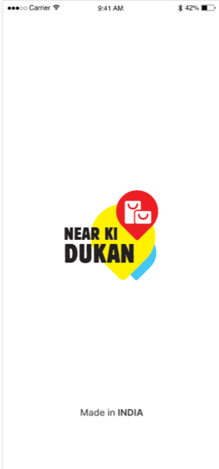
  

  

    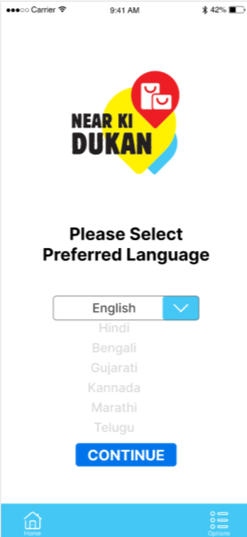
  

  

    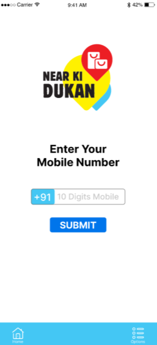
  

  

    
  

  

    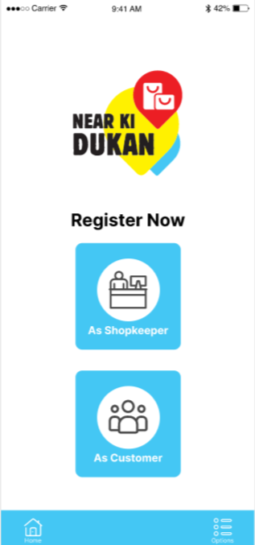
  

  

    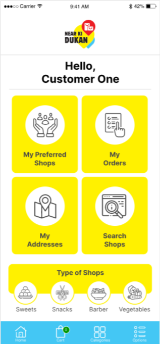
  

  

    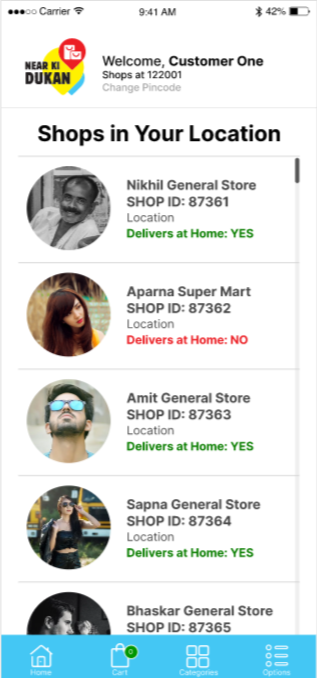
  

  

    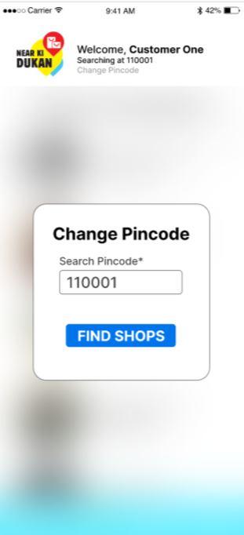
  

  

    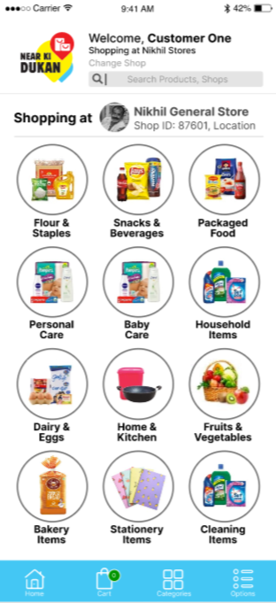
  

  

    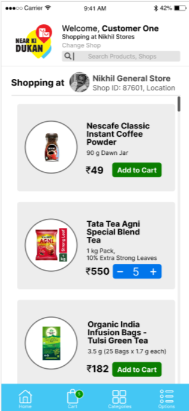
  

  

    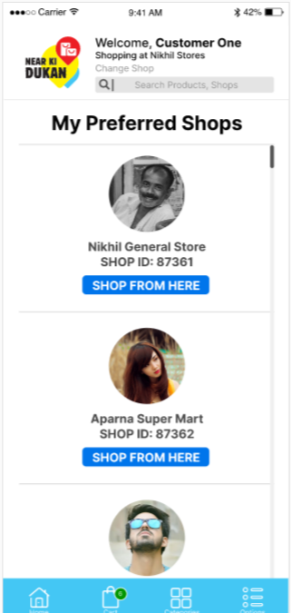
  

  

    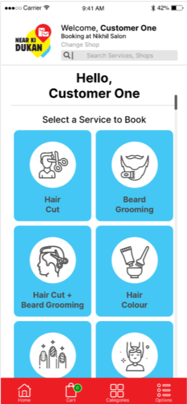
  

  

    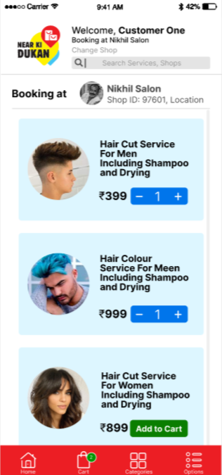
  

  

    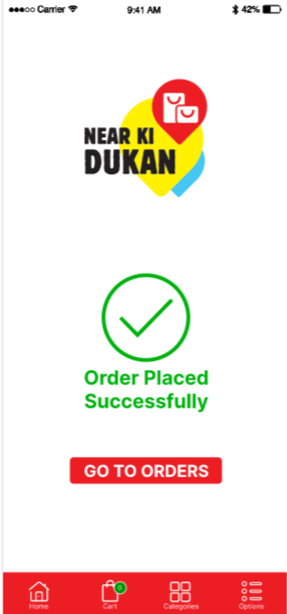
  

  

    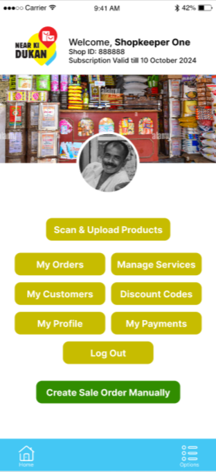
  

  

    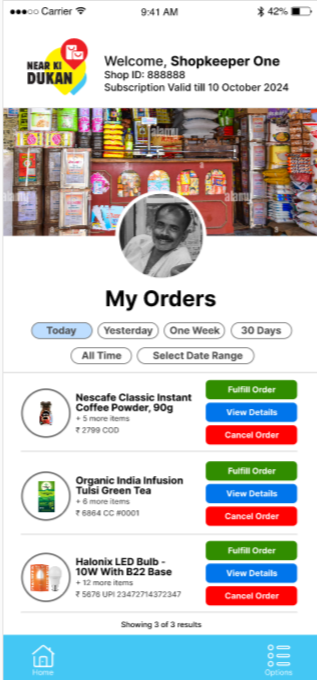
  

 

 
